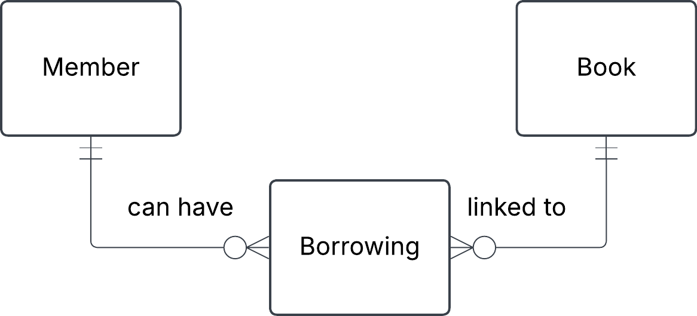

**Book**
- ISBN
- title
- author

**Member**
- membership_id
- first_name
- last_name
- phone
- address 
- email

**Borrowing**
- ISBN
- Borrowing_id
- membership_id
- return_date
- borrow_date

b. 
- a member can have zero, one or several Borrowings
- a borrowing can be made by one and only one member
- borrowing is linked to one and only one book
- a book can be in zero, one or more borrowings

c. 
Replaced many - to - many with a bridge table (composite entity)
