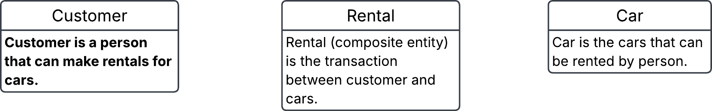

# 3. Conceptual ERD to words
This is an ERD conceptual diagram that a database designer and the business stakeholders agreed upon in a car rental company called Carent.

course structure
a) Describe the entities in this conceptual ERD.
b) Write out the relationship labels.
c) Describe the relationships between the entities (one-to-many, one-to-one and many-to-many).
d) Define the relationship statement for example: "A Customer can have one or more Rentals".

### solution

a.
- Customer is a person that can make rentals for cars.

- Car is the cars that can be rented by person.

- Rental (composite entity) is the transaction between customer and cars.

b.
alternative to put in description into the entities directly in conceptual ERD.

c. 
- Custumer to rental (one-to-many)
- rental to Customer (many-to-on)
- Rental to car (many-to-one)
- car to rental (one-to-many)

d. 
- each customer makes one or more rentals
- each rental is connected to one customer
- each rental is for one car
- each car can be in serveral rentals