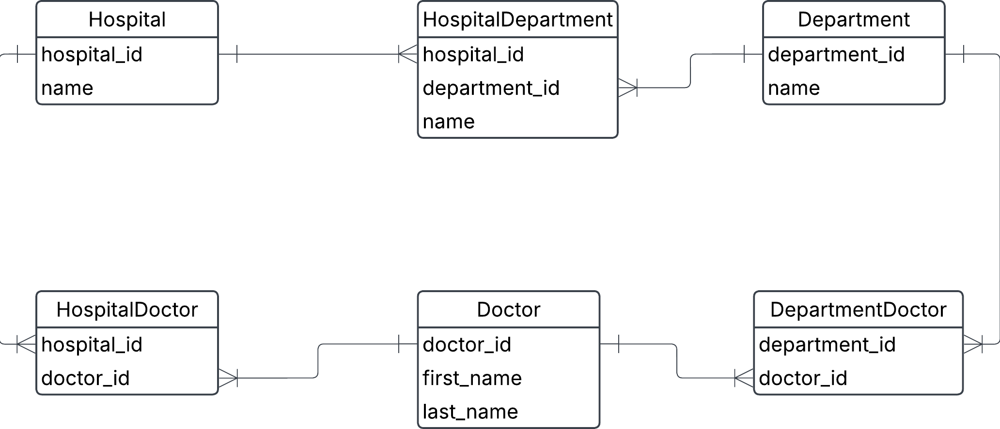

## a. Create a logical data model using lucidcharts

## b. Identify different keys on the various entities
### Primärnycklar:
- hospital_id i Hospital
- department_id i Department
- doctor_id i Doctor

### Composite keys:
- hospital_id, department_id i HospitalDepartment
- hospital_id, doctor_id i HospitalDoctor
- department_id, doctor_id i DepartmentDoctor

#### Förklaring av composite key -

En foreign key består av två eller fler kolumner som tillsammans bildar en unik identifierare för en rad i en tabell. ingen av kolumnerna ensamma kan identifiera raden unikt, men tillsammans kan dom det.

### Foreign keys:
- hospital_id i HospitalDepartment -> Hospital
- department_id i HospitalDepartment -> Department
- hospital_id i HospitalDoctor -> Hospital
- doctor_id i HopitalDoctor -> Doctor
- department_id i DepartmentDoctor -> Department
- doctor_id i DepartmentDoctor -> Doctor
#### Förklaring av foreign key -
En foreign key är ett fält i en tabell som refererar till primärnyckeln i en annan tabell. Den skapar relationer mellan olika tabeller.

## c. Identify child entities and parent entities. What makes them into parent/child relationships?

### Parent-entities:
- Hospital, Department, Doctor

### Child-entities:
- HospitalDepartment, HospitalDoctor, DepartmentDoctor
(dessa är mellanentiteter som länkar samman de överordnade entiteterna i många-till-många relationer.)