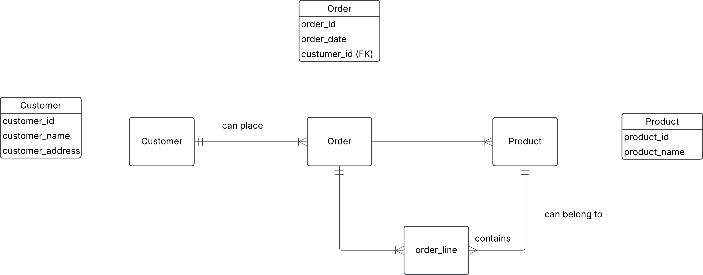

# 0. Ezecream orders
## Our beloved ice cream company Ezecream has a Sales table that looks like this

order_id	order_date	customer_id	customer_name	customer_address	product_id	product_name	quantity
101	2024-04-05	05	Ragnar Lodbrok	Kattegatt 3	3	Blåbärsmagi	20
101	2024-04-05	05	Ragnar Lodbrok	Kattegatt 3	5	Lakritsdröm	15
101	2024-04-05	05	Ragnar Lodbrok	Kattegatt 3	1	Lichipichi	35
105	2025-01-10	15	Feliz Fernadu	Madridugatan 2	8	Gitlass	30
...	...	...	...	...	...	...	...
### a. Find different problems with this table, so that Ezecream will take you in for internship to fix it for them

#### data redundancy
- definition: Samma data lagras på flera ställen, vilket kan leda till ineffektiv lagring, inkonsekvens och uppdateringsproblem.
- exempel: Order 101 existerar på flera olika ställen, om vi skulle ha flera tabeller hade inte data redundancy finnas.
#### deletion anomaly 
- Definition: när man tar bort en rad och det oavsiktligt leder till förlust av viktig annan information som man inte menat att radera.
- Exempel: Om vi skulle radera raden med order_id 101 'blåbersmagi', och det inte är någon annan order kopplad till produkten skulle vi förlora informationen om denna produkt.
#### insertion anomaly
- Definition: Man kan inte lägga till data pågrund av annan data. Det är alltså svårt eller omöjligt att lägga till ny data utan att införa fel eller onödig redundance. (tex att det blir NULLS som är onödiga eller inte tillåtna). insertion of data is not possible because values on attributes missings.
- Exempel: Om man lägger till en ny kund utan att välja product och/ eller saldo.
#### update anomaly
- Definition: Innebär att en uppdatering leder till att man måste uppdatera datan på flera olika ställen. Det uppstår ofta när det finns data redundancy (onödig duplicerad data).
- Exempel: Om en kund ändrar adress/ namn som existerar i flera olika rader så måste man manuellt gå in och ändra alla rader kopplad till den kunden. Eller acceptera inconsistent data. 

### b. Does this table satisfy 1NF, 2NF? Motivate.

#### 1NF definition: 
##### 1. radordning spelar ingen roll. 
##### 2. Varje tabell ska ha en primärnyckel. 
##### 3. Får inte reppetera grupper, det vill säga att ett attribut (kolumn) inte får ha mer än ett värde.
##### 4. uniform columns - det vill säga att en kolumn inte får innehålla olika datatyper.

1. radordningen i denna spelar ingen roll. Vi har ingen primärnyckel i tabellen då det inte finns en unikt värde som definierar en rad. 

2. Nej den uppfyller inte. den uppfyller kraven enbart om vi tolererar en implicit primary key i en compositekey form. (order_id, product_id).
men vad händer om en kund adderar samma order, samma product med en annan kvantitet?

3. det finns inte några upprepade grupper.

4. Det finns inte olika datatyper i kolumnerna.

#### 2NF definition:
##### 1. satisfies alla från first normal +
##### 2. non - primary key attribut måste vara funktionellt beroende av hela primary key och inte bara en del av den.

1. Ja om vi förutsätter att 2, på 1NF.

2. Nej, den uppfyller inte kraven för att enbart vara beroende av hela primary key. Då den beror på både order_id och product_id beroende på vilket attribut man tittar på. Tillexempel product_name är beroende product_id, och customer_address och customer_name är beroende av customer_id osv. Den är bara partially dependent on primary key.
#### för att säkerställa att den uppfyller kraven för att enbart vara beroende av hela primary keyn:
- vilken kolumn/ kolumner är din primärnyckel
- gå igenom alla kolumner som INTE är en del av primärnyckeln
- kolla om den kolumnen som inte är en del av PK är functionally dependent (helt beroende av hela) av primärnyckeln.
: om det är JA på alla --> 2NF är uppfyllt. 

#### c. Normalize this table to 3NF, make conceptual diagram and relational schema notation for each relation. Relational schema notation is RelationName(attribute1, attribute2, ...)

Customer, Order och Product är parententities och order_line är childentity. 
- order_line skapade vi för att det är två many-to-many relationer mellan order och product. I orderline lägger vi order_id, product_ id = vår composite key. quantity blir även ett attribut i vår order_line.

#### d. Now also add price attribute. Think about what would happen when price increases or decreases.

- price hade till en början känts mest rimligt att den läggs under product tabellen. där det är en price_id kolumn där priset är beroende av vilken produkt det är.
- Om priset stiger eller sjunker så fungerar inte lösning 1, då vi kommer förlora historiska ordrar (när man gör query). Man kan då göra en ny tabell som är price_list. där vi har product_id, price_id, start_date, end_date. Det är en childentitet till order_line och product. På det sättet får vi med historisk data för pris.

#### e. Write SQL code to get the total price for Ragnar Lodbrok. Insert data into your tables and test it out.

