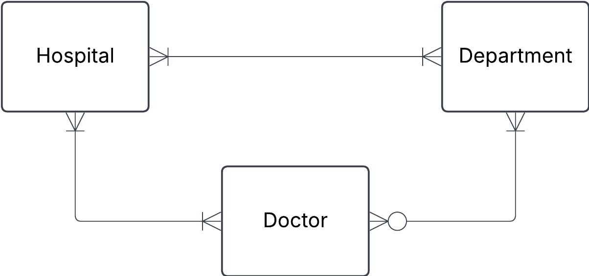
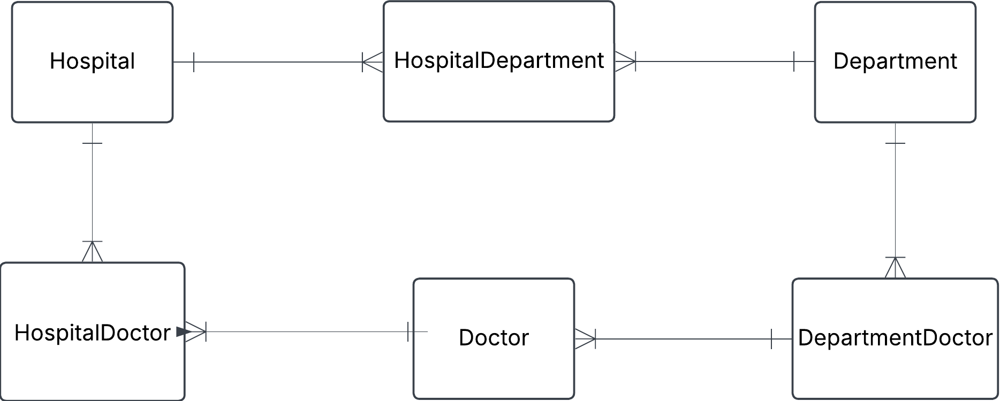

# Exercise 0

## 1. Hospital task

```json
{
  "hospital": "Sjukhusstock",
  "address": "Drottninggatan 3, Stockholm",
  "departments": [
    {
      "name": "Kardiologi",
      "doctors": [
        { "id": 1, "name": "Dr. Abra Abrahamson" },
        { "id": 2, "name": "Dr. Erika Eriksson" }
      ]
    },
    {
      "name": "Neurologi",
      "doctors": [{ "id": 3, "name": "Dr. Sven Svensson" }]
    }
  ]
}
```

## solution

Approach

- indentify entities
- identify relationships and cardinalities
- create
- create tables

Initial naitive conceptual ERD



**initial tables**

Hospital

| hospital_id | name         | address          |
| ----------- | ------------ | ---------------- |
| 1           | Sjukhusstock | Drottninggatan 3 |

Department

| department_id | name       |
| ------------- | ---------- |
| 1             | Kardiologi |
| 2             | Neurologi  |

Docktor

| doctor_id | name                 |
| --------- | -------------------- |
| 1         | Dr. Abra abramhasson |
| 2         | Dr. Erika Eriksson   |
| 3         | Dr. Sven Svensson    |



HospitalDepartment

| Hospital_department_id | hospital_id | department_id |
| ---------------------- | ----------- | ------------- |
| 1                      | 1           | 1             |
| 2                      | 1           | 2             |

HospitalDoctor

TODO: left for the reader

DepartmentDoctor

TODO: left for the reader


Test a join
Want information on Sjukhusstock and its department
- hospital_department can join with department_id on department table and hospital_id on hospital_table
- query name from hospital table and name from department table

TODO: left for reader: create thos SQL

