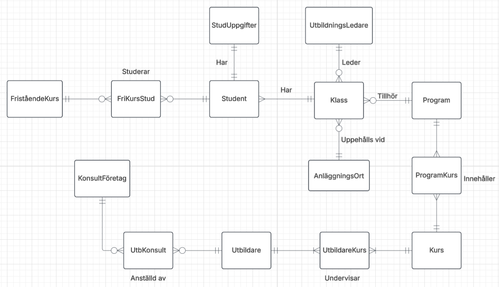
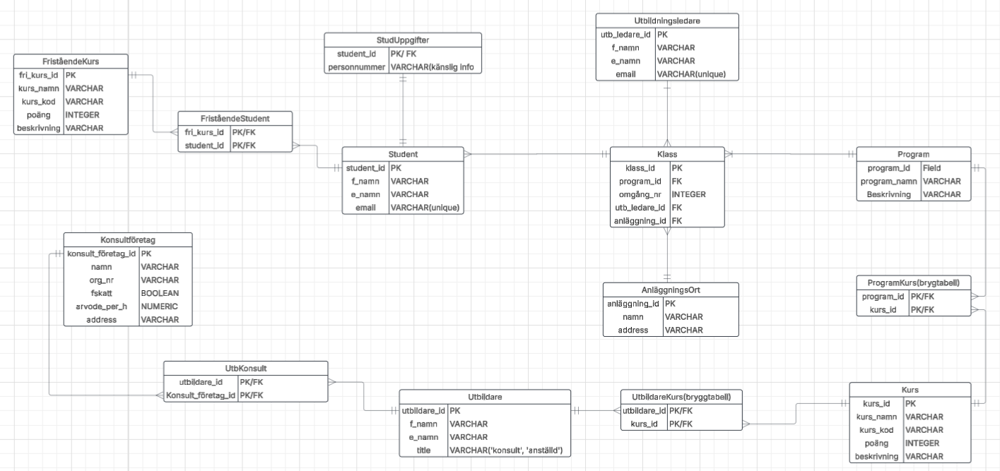
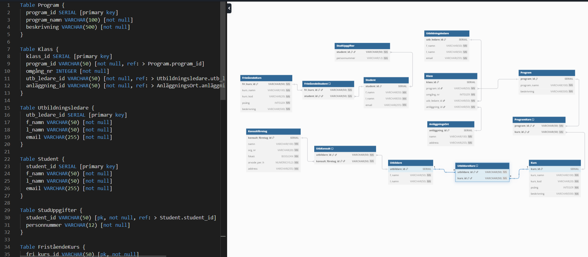

# Yh Labb - Milou Sandén Lindroth

### Kravspecifikation
#### YrkesCo har identifierat att de vill ha en databas som har information
#### om studenter, förnamn, efternamn, personnummer, email
#### utbildare kan vara konsulter
#### de planerar att anställa fasta utbildare (BONUS)
#### utbildningsledare och deras personuppgifter
#### utbildningsledare har hand om 3 klasser
#### kurser med namn, kurskod, antal poäng, kort beskrivning av kursen
#### program har ett antal kurser knutna till sig
#### ett program blir beviljat i tre omgångar, dvs att det finns 3 klasser
#### det finns även fristående kurser (BONUS)
#### konsulter, deras företag, företagsinfo som organisationsnummer, har F-skatt, address, hur mycket de tar i arvode per timma
#### YrkesCo har två anläggningar, en i göteborg och en i stockholm, i framtiden kanske de kommer expandera till flera orter (BONUS)

# Min konceptuella modell:

# Min logiska modell:

# Min fysiska modell:

## Argument för att min modell uppnår 3NF:
- Modellen uppfyller först både 1NF eftersom alla attribut är odelbara(innehåller ett och samma värde) och primärnycklar identifierar unika rader/ värden unikt. Modellen har även relationer istället för redundanta data (hanterar many-to-many relationer med bryggtabeller).

- Den uppfyller även 2NF genom att den inte har några partiella beroenden (partial dependency)  - istället har jag flyttat data till egna tabeller för att göra dom enbart beroende av sina egna primärnycklar. I bryggtabellerna är alla icke-nyckelattribut fullt beroende av hela sin primär nyckel.

- Slutligen uppfyller modellen 3NF genom att den inte har några transitiva beroenden (transitive dependency). "non-primary attributes depends on the key, the whole key and nothing but the key".
