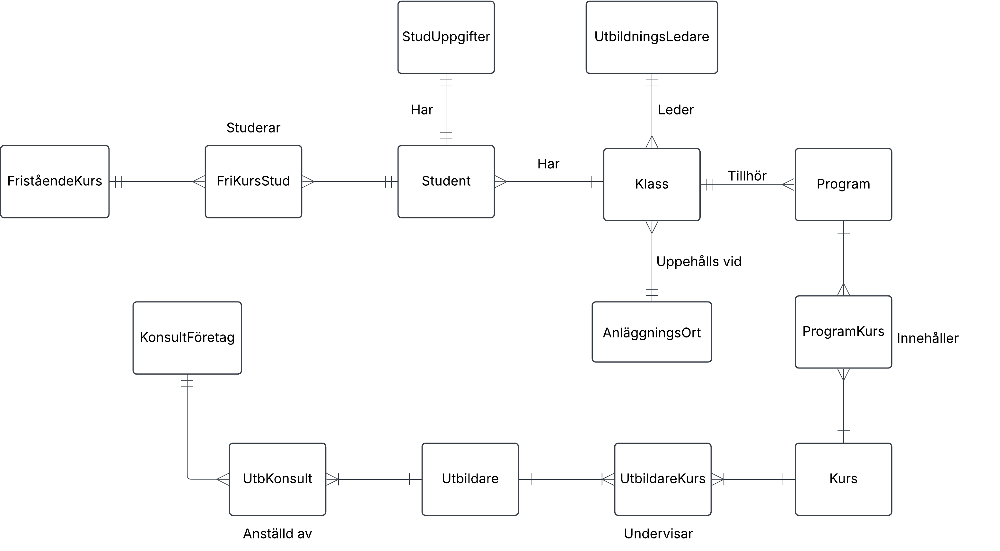
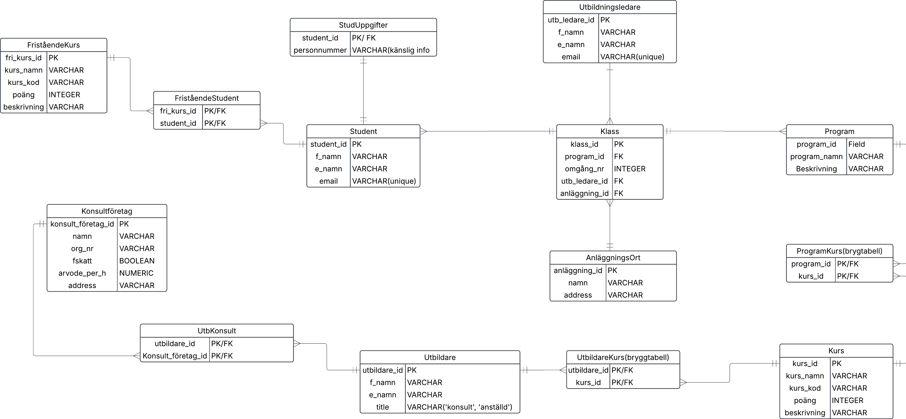

# Yh Labb - Milou Sandén Lindroth

### Kravspecifikation
#### YrkesCo har identifierat att de vill ha en databas som har information
#### om studenter, förnamn, efternamn, personnummer, email
#### utbildare kan vara konsulter
#### de planerar att anställa fasta utbildare (BONUS)
#### utbildningsledare och deras personuppgifter
#### utbildningsledare har hand om 3 klasser
#### kurser med namn, kurskod, antal poäng, kort beskrivning av kursen
#### program har ett antal kurser knutna till sig
#### ett program blir beviljat i tre omgångar, dvs att det finns 3 klasser
#### det finns även fristående kurser (BONUS)
#### konsulter, deras företag, företagsinfo som organisationsnummer, har F-skatt, address, hur mycket de tar i arvode per timma
#### YrkesCo har två anläggningar, en i göteborg och en i stockholm, i framtiden kanske de kommer expandera till flera orter (BONUS)

# Min konceptuella modell:

# Min logiska modell:

# Min fysiska modell:

